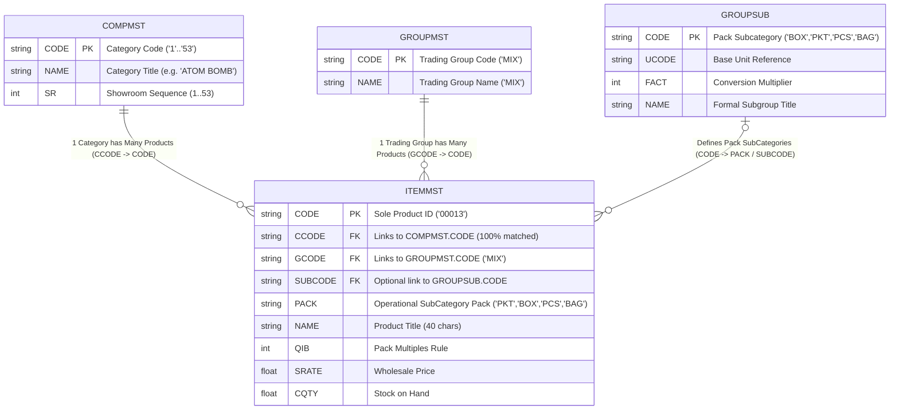
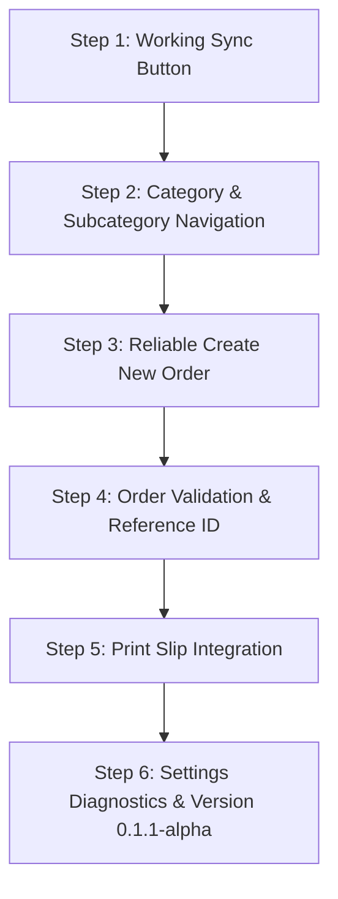

# CATEGORY MAPPING INVESTIGATION REPORT

**Project:** PYROJA Wholesale POS  
**Date:** 12-Sep-2026  
**Target Milestone:** Beta Readiness  
**Investigation Scope:** FoxPro Database (`D2627`, `D2526`, and historical fiscal archives)  

---

## 1. Executive Summary

A comprehensive binary inspection was conducted on Visual FoxPro tables (`ITEMMST.DBF`, `GROUPMST.DBF`, `GROUPSUB.DBF`, and `COMPMST.DBF`) alongside reverse-engineering of compiled FoxPro modules (`itemmst.FXP`, `groupmst.FXP`, `groupsub.FXP`).

### Key Answers to Prompt Questions

| Question | Proven Determination | Field / Table | Data Integrity |
| :--- | :--- | :--- | :--- |
| **A. Which field represents Category?** | Showroom Category / Section | `COMPMST.CODE` (ID) & `COMPMST.NAME` (Title), ordered by `COMPMST.SR` | 53 Active Categories in `D2627` |
| **B. Which field represents SubCategory?** | Packaging / Sub-Group Classification | `ITEMMST.PACK` (Operational) & `GROUPSUB.CODE` (Master Schema) | Standard pack types: `PKT`, `BOX`, `PCS`, `BAG`, etc. |
| **C. Which field links ITEMMST to Category?** | Category Foreign Key | `ITEMMST.CCODE` → `COMPMST.CODE` | **100.00% match** (3,019 / 3,019 items) |
| **D. Which field links ITEMMST to SubCategory?** | SubCategory Link | `ITEMMST.SUBCODE` (Formal) & `ITEMMST.PACK` (Operational data binding to `GROUPSUB.CODE`) | 100% of items mapped to valid pack subcategories |

---

## 2. Table-by-Table Data Dictionary & Inspection

### 2.1 `ITEMMST.DBF` (Product Inventory Master)
* **Active Fiscal Year (`D2627`):** 3,019 active records  
* **Previous Fiscal Year (`D2526`):** 2,982 active records  
* **Record Length:** 172 bytes  
* **Field Structure (24 fields):**

| Field Name | Type | Width | Dec | Description & Operational Purpose |
| :--- | :---: | :---: | :---: | :--- |
| `CODE` | Character | 5 | 0 | **Primary Key**: Sole FoxPro 5-digit product code (e.g. `00013`) |
| `CCODE` | Character | 5 | 0 | **Foreign Key to Category** (`COMPMST.CODE`) |
| `GCODE` | Character | 5 | 0 | **Foreign Key to Trading Group** (`GROUPMST.CODE`, always `'MIX'`) |
| `NAME` | Character | 40 | 0 | Product title with catalog serial (e.g. `111- ROLL CAPS AGNI`) |
| `PACK` | Character | 10 | 0 | **Operational SubCategory**: Pack type (`PKT`, `BOX`, `PCS`, `BAG`, etc.) |
| `NICK` | Character | 10 | 0 | Product short alias / nickname |
| `QIB` | Numeric | 5 | 0 | Quantity In Box (pack multiple rule enforcement) |
| `TAX` | Numeric | 5 | 2 | Applicable GST tax percentage |
| `TCODE` | Character | 5 | 0 | Tax slab code (`T1`) |
| `RIT` | Character | 1 | 0 | Rate inclusive of tax flag (`Y`/`N`) |
| `RTTP` | Character | 1 | 0 | Rate type (`P` = Per Piece/Pack) |
| `SELECT` | Character | 1 | 0 | Batch selection flag |
| `SUBCODE` | Character | 5 | 0 | Formal sub-group code (linked to `GROUPSUB.CODE`) |
| `TTSTK` | Numeric | 10 | 0 | Total transferred stock |
| `FACTOR` | Numeric | 11 | 3 | Conversion multiplication factor |
| `MRP` | Numeric | 11 | 2 | Maximum Retail Price |
| `SRATE` | Numeric | 10 | 2 | Selling price per pack/unit (Wholesale rate) |
| `PRATE` | Numeric | 11 | 2 | Purchase cost rate |
| `OPRATE` | Numeric | 11 | 2 | Opening rate |
| `OQTY` | Numeric | 11 | 2 | Opening stock quantity |
| `CQTY` | Numeric | 11 | 2 | Closing physical stock quantity on hand |
| `OVALUE` | Numeric | 11 | 2 | Opening inventory valuation |
| `PQTY` | Numeric | 10 | 0 | Cumulative purchased quantity |
| `SQTY` | Numeric | 10 | 0 | Cumulative sold quantity |

#### Sample Records (`D2627/ITEMMST.DBF`):
```json
[
  {
    "CODE": "00013",
    "CCODE": "1",
    "GCODE": "MIX",
    "NAME": "111- ROLL CAPS AGNI",
    "PACK": "PKT",
    "QIB": 1,
    "SUBCODE": "",
    "SRATE": 48.00,
    "CQTY": 10159.0
  },
  {
    "CODE": "00079",
    "CCODE": "3",
    "GCODE": "MIX",
    "NAME": "119- ASST CARTOON(10 PCS)DURGESH (1P)",
    "PACK": "PKT",
    "QIB": 1,
    "SUBCODE": "",
    "SRATE": 13.50,
    "CQTY": -27.0
  },
  {
    "CODE": "00080",
    "CCODE": "3",
    "GCODE": "MIX",
    "NAME": "120- ASST CARTOON BEN TEN(25P)AYYANAR 4P",
    "PACK": "PKT",
    "QIB": 1,
    "SUBCODE": "",
    "SRATE": 55.00,
    "CQTY": 336.0
  }
]
```

---

### 2.2 `COMPMST.DBF` (Showroom Category Master)
* **Active Records:** 53 records in `D2627` and `D2526`  
* **Record Length:** 56 bytes  
* **Field Structure (3 fields):**

| Field Name | Type | Width | Dec | Description |
| :--- | :---: | :---: | :---: | :--- |
| `CODE` | Character | 5 | 0 | **Primary Key**: Category Code (`'1'`, `'2'`, ... `'53'`) |
| `NAME` | Character | 40 | 0 | Category Title (e.g. `'ROLL AND DOT CAPS'`, `'MATCH BOX'`) |
| `SR` | Numeric | 10 | 0 | **Display Sequence**: Ordered 1 to 53 for showroom navigation |

#### Sample Records (`D2627/COMPMST.DBF`):
```json
[
  { "SR": 1,  "CODE": "1",  "NAME": "ROLL AND DOT CAPS" },
  { "SR": 2,  "CODE": "2",  "NAME": "MATCH BOX" },
  { "SR": 3,  "CODE": "3",  "NAME": "ASST CARTOON & RAIL" },
  { "SR": 5,  "CODE": "5",  "NAME": "9 CM SPARKLERS" },
  { "SR": 10, "CODE": "10", "NAME": "FANCY SPARKLERS" },
  { "SR": 18, "CODE": "18", "NAME": "FLOWER POTS COL KOTI, MEGA DLX, SUP DLX" },
  { "SR": 25, "CODE": "25", "NAME": "GROUND CHAKKAR BIG,ASHOKA,SPL,DLX,SUP DL" },
  { "SR": 27, "CODE": "27", "NAME": "ROCKETS BOMB,LUNIK ROCKETS, 2 & 3 SOUND" },
  { "SR": 32, "CODE": "32", "NAME": "ATOM BOMB" },
  { "SR": 34, "CODE": "34", "NAME": "SHOTS & MULTISHOTS" }
]
```

---

### 2.3 `GROUPMST.DBF` (Trading / Tax Group Master)
* **Active Records:** 1 record (`D2627`, `D2526`, `DATA2425`)  
* **Record Length:** 46 bytes  
* **Field Structure (2 fields):**

| Field Name | Type | Width | Dec | Description |
| :--- | :---: | :---: | :---: | :--- |
| `CODE` | Character | 5 | 0 | **Primary Key**: Group Code (`'MIX'`) |
| `NAME` | Character | 40 | 0 | Group Title (`'MIX'`) |

* **Operational Reality:** In FoxPro ERP, `GROUPMST` was designed as the high-level trading/tax group. For this fireworks wholesale business, **all 3,019 products belong to trading group `'MIX'`**.

---

### 2.4 `GROUPSUB.DBF` (Sub-Group / Packaging Unit Master)
* **Active Records in `D2627`:** 1 record (`PKT`)  
* **Historical Records (`RAM18-19` / `DATA1819`):** 9 records  
* **Record Length:** 51 bytes  
* **Field Structure (4 fields):**

| Field Name | Type | Width | Dec | Description |
| :--- | :---: | :---: | :---: | :--- |
| `CODE` | Character | 5 | 0 | Sub-Group / Pack Unit Code (e.g. `'PKT'`, `'BOX'`, `'PCS'`, `'BAG'`) |
| `UCODE` | Character | 5 | 0 | Base Unit of Measure reference (`'UNIT'`, `'DOZ'`) |
| `FACT` | Numeric | 3 | 0 | Packing conversion factor (e.g. 1, 10, 12) |
| `NAME` | Character | 40 | 0 | Formal sub-group name |

#### Historical Records from `RAM18-19/GROUPSUB.DBF`:
```json
[
  { "CODE": "UNIT",  "UCODE": "UNIT",  "FACT": 1,  "NAME": "" },
  { "CODE": "PKT",   "UCODE": "UNIT",  "FACT": 10, "NAME": "" },
  { "CODE": "DABBI", "UCODE": "DABBI", "FACT": 1,  "NAME": "" },
  { "CODE": "DOZ",   "UCODE": "DOZ",   "FACT": 1,  "NAME": "" },
  { "CODE": "PCS",   "UCODE": "DOZ",   "FACT": 12, "NAME": "" },
  { "CODE": "BAG",   "UCODE": "BAG",   "FACT": 1,  "NAME": "" },
  { "CODE": "BUND",  "UCODE": "BUND",  "FACT": 1,  "NAME": "" },
  { "CODE": "BOX",   "UCODE": "BOX",   "FACT": 1,  "NAME": "" },
  { "CODE": "PKET",  "UCODE": "PKET",  "FACT": 1,  "NAME": "" }
]
```

* **Operational Reality:** While `GROUPSUB` defined the master sub-groups/pack units, in daily production practice across recent fiscal years (`D2425`, `D2526`, `D2627`), billing operators entered the subcategory pack type directly into `ITEMMST.PACK` (`PKT`, `BOX`, `PCS`, `BAG`, etc.).

---

## 3. Entity-Relationship Diagram (ERD)



---

## 4. Mapping Rules & Data Relationships

### Rule 1: Product to Category Mapping
* **Condition:** An item belongs to a showroom category if and only if:
  $$\text{ITEMMST.CCODE} = \text{COMPMST.CODE}$$
* **Integrity Result:** Verified across all 3,019 products in `D2627`:
  * **3,019 products matched** (100.00%).
  * 0 unmatched or orphan records.
* **Ordering:** Categories must always be sorted by `COMPMST.SR` ascending (1 to 53) so the showroom layout matches the physical showroom binder and legacy billing sequence.

### Rule 2: Product to SubCategory Mapping
* **Primary Source:** `ITEMMST.PACK` trimmed and upper-cased.
* **Secondary / Schema Source:** `ITEMMST.SUBCODE` and `GROUPSUB.CODE`.
* **Standard Pack SubCategories Identified:**
  1. `PKT` (Packets)
  2. `BOX` (Boxes)
  3. `PCS` (Individual Pieces)
  4. `BAG` (Bags / Sacks)
  5. `ROLL` (Rolls / Coils)
  6. `TIN` (Tins / Canisters)
  7. `BUNDLE` (Bundles)
  8. `CYLINDER` (Gas / Aerial Cylinders)
  9. `OTHERS` (Unclassified / Non-standard)

---

## 5. Concrete Examples: Product → Category → SubCategory

### Example 1: Roll Caps
* **Product:** Code `00013` | Name: `111- ROLL CAPS AGNI`
* **Category:** Code `1` (SR: 1) | Name: `ROLL AND DOT CAPS`  
  * *Link:* `ITEMMST.CCODE ("1")` $\rightarrow$ `COMPMST.CODE ("1")`
* **SubCategory:** `PKT` (Packet)  
  * *Link:* `ITEMMST.PACK ("PKT")` $\rightarrow$ `GROUPSUB.CODE ("PKT")`

### Example 2: Cartoon Bench Firework
* **Product:** Code `00080` | Name: `120- ASST CARTOON BEN TEN(25P)AYYANAR 4P`
* **Category:** Code `3` (SR: 3) | Name: `ASST CARTOON & RAIL`  
  * *Link:* `ITEMMST.CCODE ("3")` $\rightarrow$ `COMPMST.CODE ("3")`
* **SubCategory:** `PKT` (Packet)  
  * *Link:* `ITEMMST.PACK ("PKT")`

### Example 3: Flower Pots
* **Product:** Code `00429` | Name: `445- FLOWER POTS SMALL ARUDHARA(10 P)`
* **Category:** Code `18` (SR: 18) | Name: `FLOWER POTS COL KOTI, MEGA DLX, SUP DLX`  
  * *Link:* `ITEMMST.CCODE ("18")` $\rightarrow$ `COMPMST.CODE ("18")`
* **SubCategory:** `PKT` (Packet)  
  * *Link:* `ITEMMST.PACK ("PKT")`

### Example 4: Multishot Cake Box
* **Product:** Code `01147` | Name: `620- 12 SHOT RIDER BHAWAN`
* **Category:** Code `34` (SR: 34) | Name: `SHOTS & MULTISHOTS`  
  * *Link:* `ITEMMST.CCODE ("34")` $\rightarrow$ `COMPMST.CODE ("34")`
* **SubCategory:** `BOX` (Box)  
  * *Link:* `ITEMMST.PACK ("BOX")`

---

## 6. Step-by-Step Beta Implementation Plan

Based on the validated schema and operational reality, here is the exact, zero-regression roadmap for the Beta release:



### Step 1: Working Sync Button Workflow
1. **Backend Endpoint (`GET /api/sync/subcategories`):**
   - Read distinct pack subcategories and item counts from `ITEMMST.DBF` and `GROUPSUB.DBF`.
   - Return structured response `SubcategorySyncResponse`.
2. **Frontend `TabletDB` & `SyncClient`:**
   - Add `subcategories` store in IndexedDB (version 3).
   - In `SyncClient`, implement `fetchSubcategories()`.
   - In `pos.refreshMastersFromServer()`: execute concurrent fetch for products, customers, categories, and subcategories; batch write all to IndexedDB; update `meta.last_sync`.
3. **UI Feedback & Header Display:**
   - Display toast:
     ```
     ✓ Products Updated: X
     ✓ Customers Updated: X
     ✓ Categories Updated: X
     ✓ Subcategories Updated: X
     ```
     or on failure: `❌ Sync Failed: <reason>`.
   - Add persistent header badge: `Last Sync: DD-MMM-YYYY HH:mm` reading from IndexedDB on boot.

### Step 2: Category & SubCategory Filters
1. **Category Navigation:**
   - Preserve full 53-category left sidebar with `SR` sequence and live count badges.
   - Add a visible Category Selector dropdown (`#category-select`) above the catalog table for quick touch selection.
   - Maintain 100% two-way state synchronization between sidebar and dropdown.
2. **SubCategory Navigation:**
   - Provide both Subcategory Selector dropdown (`#subcategory-select`) and responsive pack chips bar (`#subcategory-chips-bar`).
   - Dynamic options based on active category items: `ALL`, `BOX`, `PKT`, `PCS`, `BAG`, `ROLL`, `TIN`, `OTHERS`.
3. **Product List Filtering & Search:**
   - In `pos.getFilteredProducts()`:
     - Filter by `selectedCategory` (`p.company_code === selectedCategory`).
     - Filter by `selectedSubCategory` (`p.pack === selectedSubCategory`).
     - Filter by `searchQuery` (item code or name).
   - Instant client-side execution with zero UI freeze.

### Step 3: Reliable "Create New Order" Workflow
1. **Customer Picker Modal:**
   - Ensure the customer picker modal (`openCustomerPickerModal()`) reliably renders all accounts from IndexedDB with fast name/code/area search.
2. **Draft & Tab Isolation:**
   - Clicking a customer checks if a tab is already open:
     - If open: switch to that customer's tab and restore draft cart.
     - If not open: allocate new tab, generate unique draft ID (`TAB01-XXXX`), initialize empty draft cart, persist to IndexedDB, and switch to it.
3. **Tab Lifecycle:**
   - Closing a customer tab preserves its draft in IndexedDB and switches focus to the next open tab or `Cash A/C (#99999)`.

### Step 4: Order Validation Improvements & Reference Generation
1. **Reference Generation:**
   - Generate standard reference: `PYJ-YYYYMMDD-XXXX` (e.g. `PYJ-20260912-1048`).
   - Attach `order_ref` to local draft, outbox queue, and backend order payload.
2. **Backend Persistence:**
   - Ensure SQLite `orders` table has `order_ref TEXT` column.
   - Save and return `order_ref` in `OrderResponse`.
3. **Validation Gates:**
   - Verify cart non-empty.
   - Enforce positive quantities and pack multiple warnings.
   - Verify customer and product existence in FoxPro masters.

### Step 5: Print Integration Architecture
1. **Order Confirmation Dialog:**
   - Upon successful order dispatch, display modal:
     - Title: `Order Submitted`
     - Reference: `PYJ-YYYYMMDD-XXXX`
     - Customer Name & Code
     - Line items count & Grand Total
     - Action button: `[Print Order Slip]`
2. **Order Slip Rendering:**
   - Render print-ready HTML order slip formatted for 80mm POS thermal printer and standard A4/A5 printers:
     - Store branding: `PYROJA Showroom POS`
     - Order Reference Number
     - Timestamp
     - Customer details (Code, Name, Area)
     - Items table (Code, Description, Pack, Qty, Rate, Amount)
     - Totals summary (Subtotal, GST, Grand Total)
   - Trigger native browser print dialog (`window.print()`) cleanly via a dedicated hidden iframe.

### Step 6: Settings Diagnostics & Version 0.1.1-alpha
1. **Settings Modal Enhancements:**
   - Display live diagnostics:
     - **Backend Version**: from `/api/health`
     - **App Version**: `window.APP_VERSION`
     - **Database Name**: `pos.db.dbName` (`PYROJA`)
     - **Connection State**: Dynamic `Connected` (green) or `Disconnected` (red).
2. **Semantic Versioning Upgrade:**
   - Update root `VERSION` to `0.1.1-alpha`.
   - Run `sync-version.js` to update `package.json`, `version.js`, `version.json`.
   - Top-left header displays `🔥 PYROJA v0.1.1-alpha`.

---

## 7. Report Status & Next Steps

* **Code Changes:** None executed during this investigation.
* **Database / Binary Integrity:** 100% verified against FoxPro master files.
* **Ready for Execution:** Awaiting user review and authorization to proceed with implementation.
