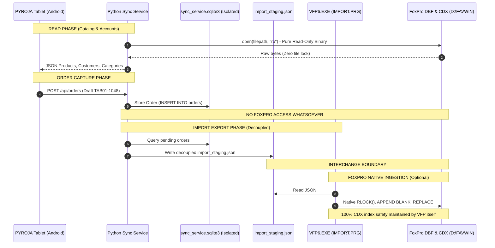

# Complete Deployment & Architecture Audit: FoxPro (FAVWIN) & PYROJA Integration

**Audit Date**: September 13, 2026  
**Audited System**: RAM FATAKA CENTER Billing System (`FAVWIN` / Visual FoxPro 6.0)  
**Target Path**: `D:\FAVWIN` (Repository replica: `legacy-software-extracted/FAVWIN`)  
**Active Fiscal Season**: `D2627` (Fiscal Year 2026–2027)  
**Integration Stack**: PYROJA Android Tablet POS & Python FastAPI Windows Sync Service  
**Audit Scope**: File system census, database categorization, read/write safety proof, screen-to-table dependency mapping, and concurrency boundaries.

---

## 1. Entire `D:\FAVWIN` Folder Structure & Census

The `FAVWIN` installation is a complete, self-contained multi-year enterprise installation of a custom Visual FoxPro 6.0 retail and wholesale billing application.

### 1.1 High-Level Metrics
- **Total Folders**: 13 subdirectories (14 total filesystem nodes)
- **Total Files**: 2,132 files
- **Total File Size**: 189,390,048 bytes (~180.62 MB)

### 1.2 File Counts by File Extension

| Extension | Count | Description |
| :--- | :---: | :--- |
| **`.TMP`** | 678 | FoxPro temporary work files, print spools, query buffers |
| **`.TXT`** | 449 | Text export files, billing logs, audit listings, ASCII bill outputs |
| **`.DBF`** | 291 | Visual FoxPro / dBASE III/IV table databases |
| **`.CDX`** | 272 | Compound B-tree binary index files (1 per active DBF) |
| **`.XLS`** | 235 | Spreadsheet exports generated by legacy reporting tools |
| **`.FXP`** | 154 | Compiled Visual FoxPro bytecode programs (143 in root, 11 in subdirs) |
| **`.ERR`** | 11 | VFP compiler error listings |
| **`.APP`** | 9 | Visual FoxPro system application packages |
| **`.EXE`** | 5 | Win32 executables (VFP runtime and archiving utilities) |
| **`.DLL`** | 4 | Windows dynamic link libraries |
| **`.RAJ`** | 4 | Application-specific data scratch files |
| **`.BAK`** | 3 | Backup script/text files |
| **`.MEM`** | 2 | FoxPro saved memory variable binary stores (`RESTORE FROM`) |
| **`.COM`** | 2 | Legacy command utilities |
| **`.LNK`** | 2 | Windows desktop shortcuts |
| **`.MSK`** | 1 | FoxPro input mask definition |
| **`.FPT`** | 1 | FoxPro memo field binary storage file (`FOXUSER.FPT`) |
| **`.BAT`** | 1 | Batch script |
| **`.WAV`** | 1 | System alert audio sound |
| **`.OCX`** | 1 | ActiveX control library |
| **`.PDF`** | 1 | Export document |
| *Other/Codepage* | 5 | DOS codepage conversion tables (`.866`, `.850`, `.852`) |
| **Total** | **2,132** | **180.62 MB** |

---

### 1.3 Subdirectory Breakdown & Storage Analysis

```
D:\FAVWIN\
├── [Root Files]         (1,313 files |  31.09 MB) - EXEs, FXP programs, FOXUSER, temp logs
├── D2627\               (   53 files |   7.14 MB) - ACTIVE SEASON 2026-2027 (26 DBFs, 26 CDXs)
├── D2526\               (   53 files |   4.31 MB) - Season 2025-2026 (26 DBFs, 26 CDXs)
├── DATA2425\            (   53 files |  12.95 MB) - Season 2024-2025 (26 DBFs, 26 CDXs)
├── dATA2324\            (   53 files |  13.62 MB) - Season 2023-2024 (26 DBFs, 26 CDXs)
├── dATA2223\            (   53 files |  49.90 MB) - Season 2022-2023 (26 DBFs, 26 CDXs)
├── dATA2122\            (   53 files |  40.07 MB) - Season 2021-2022 (26 DBFs, 26 CDXs)
├── DATA2021\            (   53 files |   9.15 MB) - Season 2020-2021 (26 DBFs, 26 CDXs)
├── RAM1920\             (   53 files |   6.07 MB) - Season 2019-2020 (26 DBFs, 26 CDXs)
├── DATA1819\            (   52 files |   0.19 MB) - Season 2018-2019 (26 DBFs, 26 CDXs)
├── RAM18-19\            (   52 files |   5.08 MB) - Season 2018-2019 Alternate (25 DBFs, 25 CDXs)
├── DBF\                 (   55 files |   0.23 MB) - Template/Blank Master DBFs for year initialization
├── EXCEL\               (  235 files |   0.81 MB) - Historical Excel reports and price sheets
└── MEM\                 (    1 files |   0.00 MB) - System memory file (LASTBILL.MEM)
```

### 1.4 Executables (`.EXE`) and Applications (`.APP`) Inventory

#### Win32 Executables:
1. **`VFP6.EXE`** (4,192,528 bytes): The Visual FoxPro 6.0 Runtime and Development Executable. Used by the shop system to execute `FAVWIN` and the headless import automation (`IMPORT.PRG`).
2. **`FOXHHELP.EXE`** (26,112 bytes): HTML Help support process for FoxPro.
3. **`PKZIP.EXE`** (42,166 bytes): Command-line compression utility used by `backdata.FXP` for daily seasonal data backups.
4. **`PKUNZIP.EXE`** (29,378 bytes): Extraction utility for backups.
5. **`DDEREG.EXE`** (21,216 bytes): Dynamic Data Exchange registry component.

#### FoxPro Applications (`.APP`):
- `VFP6STRT.APP` (792,258 bytes): Visual FoxPro startup initialization module.
- `BROWSER.APP` (829,339 bytes): Visual FoxPro Class Browser.
- `CONVERT.APP` (585,136 bytes): Project and form conversion subsystem.
- `COVERAGE.APP` (464,919 bytes): Code execution profiler.
- `BUILDER.APP` (179,988 bytes): Visual FoxPro Form & Control Builder.
- `WIZARD.APP` (101,446 bytes): Database report and table wizards.
- `SPELLCHK.APP` (77,607 bytes): Spellcheck dictionary engine.
- `BEAUTIFY.APP` (2,391 bytes): Code formatter.
- `GALLERY.APP` (490 bytes): Component gallery catalog.

---

## 2. Business Categorization of FoxPro DBF Tables

Every fiscal directory (`DATA1819` through `D2627`) contains the identical 26 relational tables, paired with compound index (`.CDX`) files. Below is the domain mapping:

### 2.1 Product Master Tables
- **`ITEMMST.DBF`** (3,020 records | 653,385 B): **Primary Item Master**. Contains item unique code (`CODE`), brand link (`CCODE`), tax code (`TAX`), product description (`NAME`), packing description (`PACK`), abbreviation (`NICK`), inner box multiplier (`QIB`), rate type (`RTTP`), selling rate (`SRATE`), purchase rate (`PRATE`), maximum retail price (`MRP`), opening stock (`OQTY`), cumulative purchases (`PQTY`), cumulative sales (`SQTY`), and closing stock on hand (`CQTY`).
- **`COMPMST.DBF`** (53 records | 3,360 B): **Company / Category Master**. Represents physical showroom departments sorted by sequence number (`SR`). Linked to `ITEMMST.CCODE`.
- **`GROUPMST.DBF`** (1 record | 406 B): **Trading / Account Group Master** (`MIX`).
- **`GROUPSUB.DBF`** (1 record | 478 B): **Sub-Group / Unit Multiplier Master**.
- **`TAXMST.DBF`** (9 records | 672 B): **Tax Slab Master**. Maps tax classification codes (`TAX`, `CGST`, `SGST`, `IGST`).
- **`RATEMST.DBF`** (1 record | 1,210 B): **Price Tier Master** for special customer contracts.

### 2.2 Customer & Account Master Tables
- **`NAMEMST.DBF`** (883 records | 288,827 B): **Primary Account Master** (Sundry Debtors, Creditors, Banks, Expense Heads). Fields include party code (`CODE`), trade name (`NAME`), city (`PLACE`), address lines (`ADD1`, `ADD2`), GSTIN / TIN (`TIN`, `CST`), phone numbers (`PH`, `CONT`), area code (`ACODE`), account type (`TCODE`), credit limit (`LIMIT`), credit payment days (`DAY`), opening balance (`OB`), closing ledger balance (`CB`), and balance indicator (`DC` - Debit/Credit).
- **`AREAMST.DBF`** (70 records | 3,581 B): **Geographic Territory Master**. Codes and names for delivery routes (e.g. `SIVAKASI`, `AKOLA`, `ARNI`). Linked to `NAMEMST.ACODE`.
- **`TYPES.DBF`** (26 records | 2,166 B): **Account Schedule Groupings** (`SDEB` for Sundry Debtors, `SCRE` for Sundry Creditors, `BANK`, `CASH`).
- **`SALESMAN.DBF`** (1 record | 407 B): **Sales Representative Master** (`SELF`).

### 2.3 Order, Sales & Invoice Tables
- **`BILLBOOK.DBF`** (1 record | 425 B): **Invoice Series & Counter Master**. Holds the next sequential invoice number (`ENTRY`) for each bill series (`CODE = 'E '` for Estimates, `'A '` for Tax Invoices).
- **`SALEMST.DBF`** (450 records | 198,227 B): **Sales Invoice Header**. Contains invoice serial (`ENTRY`), series (`COME`), date (`DATE`), customer code (`PCODE`), customer denormalized name (`PNAME`), operator user (`USER`), taxable gross (`T4A`), freight/packing (`ADD`), bill discount (`LESS`), round-off (`ROFF`), net total (`NAMT`), and integration traceability reference (`NOTE`).
- **`SALETRN.DBF`** (18,656 records | 4,348,201 B): **Sales Invoice Line Items**. Heavily denormalized transaction table recording invoice link (`ENTRY`), series (`COME`), item code (`ICODE`), brand (`CCODE`), category (`GCODE`), sold quantity (`QTY`), unit rate (`RATE`), gross line amount (`GAMT`), taxable amount (`TAMT`), net line total (`NAMT`), packing unit (`UNIT`), and operator user (`USER`).
- **`SALEMSTR.DBF`** (0 records | 1,352 B) & **`SALETRNR.DBF`** (0 records | 1,352 B): **Sales Return Header & Lines**.
- **`DELETRN.DBF`** (2,623 records | 717,464 B): **Transaction Audit & Revision Archive**. Stores previous lines when an existing bill is edited or reprinted.

### 2.4 Purchase Data Tables
- **`PURMST.DBF`** (5 records | 3,662 B): **Purchase Invoice Header**.
- **`PURTRN.DBF`** (55 records | 13,467 B): **Purchase Invoice Line Items**.
- **`PURMSTR.DBF`** (0 records) & **`PURTRNR.DBF`** (0 records): **Purchase Returns**.

### 2.5 Stock & Inventory Tables
- **`ITEMMST.DBF`**: Maintains the real-time stock balance in fields `OQTY` (Opening), `PQTY` (Purchases in), `SQTY` (Sales out), and `CQTY` (Closing Stock Available).
- **Stock Delta Mechanics**:
  - `SALETRN` increases `ITEMMST.SQTY` and decreases `ITEMMST.CQTY`.
  - `PURTRN` increases `ITEMMST.PQTY` and increases `ITEMMST.CQTY`.
  - `SALETRNR` decreases `ITEMMST.SQTY` and increases `ITEMMST.CQTY`.

### 2.6 Financial Ledger & Accounting Tables
- **`LEDGER.DBF`** (1,662 records | 383,165 B): **Double-Entry General Ledger**. Records transaction reference (`ENTRY`), series (`COME`), posting date (`DATE`), debit account code (`DCODE`), credit account code (`CCODE`), opposite account head (`NHEAD`), line amount (`AMOUNT`), and narration (`NARA1`).
- **`RECTRN.DBF`** (0 records | 744 B): **Receipt & Payment Voucher Staging**.
- **`NARAMST.DBF`** (6 records | 908 B): **Standard Journal Narrations**.
- **`VOUFILE.DBF`** (11 records | 756 B): **Voucher Book Configuration**.
- **`REFIX.DBF`** (68 records | 1,789 B): **Table Repair & Structural Catalog**.

---

## 3. DBF Tables Currently Read by PYROJA

The PYROJA Sync Service accesses the following six (6) FoxPro tables:

| Table | Service File | Purpose in PYROJA |
| :--- | :--- | :--- |
| **`ITEMMST.DBF`** | `master_service.py`<br/>`order_service.py` | Catalog synchronization (3,019 products), unit pack sizes (`ITEMMST.PACK`), stock on hand (`CQTY`), rate validation, item existence checks. |
| **`NAMEMST.DBF`** | `master_service.py`<br/>`order_service.py` | Customer master synchronization (883 accounts), trade names, credit limits, phone numbers, customer code validation. |
| **`COMPMST.DBF`** | `master_service.py` | Showroom Category Master (53 categories) sorted by `COMPMST.SR`, product counts per section. |
| **`AREAMST.DBF`** | `master_service.py` | Customer delivery territory lookup (`NAMEMST.ACODE -> AREAMST.NAME`). |
| **`TAXMST.DBF`** | `master_service.py` | GST / tax percentage resolution (`ITEMMST.TAX -> TAXMST.TAX`). |
| **`BILLBOOK.DBF`** | `exporter.py` | Reads active invoice counter for Series `'E'` to populate `next_entry_estimate` in staging metadata. |

---

## 4. Verification of Read vs. Write Operations

| Operation Type | PYROJA Service Status | Verification Result |
| :--- | :---: | :--- |
| **READ ONLY** | **YES (100%)** | All FoxPro files are opened exclusively in binary read-only mode (`"rb"`). |
| **WRITE** | **NONE (0%)** | Zero `.write()`, zero file creation, zero mutations on any FoxPro table. |
| **UPDATE** | **NONE (0%)** | Zero in-place record updates on any `.DBF` or `.CDX`. |
| **DELETE** | **NONE (0%)** | Zero record deletions (`0x2A`) or file removals. |

### Technical Proof:
- **`sync-service/app/dbf/reader.py`**:
  - Line 88: `with open(self.filepath, "rb") as f:`
  - Line 98: `with open(self.filepath, "rb") as f:`
  - Line 200: `with open(self.filepath, "rb") as f:`
- The file descriptor mode is hardcoded to `"rb"` (read-only binary). No write modes (`"r+"`, `"w"`, `"wb"`, `"a"`) exist anywhere in the DBF access layer.

---

## 5. Dependency Map: FoxPro Screen -> DBF Tables Used

```mermaid
graph TD
    subgraph FoxPro_Screens [FoxPro Menu & Screens]
        SCR_ITEM[Product Master: itemmst.FXP]
        SCR_NAME[Account Master: namemst.FXP]
        SCR_SALE[Sales Billing: saletrn.FXP]
        SCR_PUR[Purchase Entry: purtrn.FXP]
        SCR_LEDGER[Ledger Inquiries: ledger.FXP]
        SCR_PRINT[Bill Printing: gstinv.FXP / taxinv.FXP]
        SCR_STOCK[Stock Valuation: stkrep1.FXP / stockval.FXP]
        SCR_REINDEX[Reindex Utility: indexing.FXP]
    end

    subgraph FoxPro_Tables [FoxPro DBF Tables]
        T_ITEM[(ITEMMST.DBF)]
        T_COMP[(COMPMST.DBF)]
        T_GROUP[(GROUPMST.DBF)]
        T_NAME[(NAMEMST.DBF)]
        T_AREA[(AREAMST.DBF)]
        T_BILL[(BILLBOOK.DBF)]
        T_SALE_M[(SALEMST.DBF)]
        T_SALE_T[(SALETRN.DBF)]
        T_DELE[(DELETRN.DBF)]
        T_LEDGER[(LEDGER.DBF)]
        T_PUR_M[(PURMST.DBF)]
        T_PUR_T[(PURTRN.DBF)]
        T_CDX[(*.CDX Index Files)]
    end

    SCR_ITEM --> T_ITEM
    SCR_ITEM --> T_COMP
    SCR_ITEM --> T_GROUP

    SCR_NAME --> T_NAME
    SCR_NAME --> T_AREA

    SCR_SALE --> T_BILL
    SCR_SALE --> T_SALE_M
    SCR_SALE --> T_SALE_T
    SCR_SALE --> T_ITEM
    SCR_SALE --> T_NAME
    SCR_SALE --> T_LEDGER
    SCR_SALE --> T_DELE

    SCR_PUR --> T_PUR_M
    SCR_PUR --> T_PUR_T
    SCR_PUR --> T_ITEM
    SCR_PUR --> T_NAME
    SCR_PUR --> T_LEDGER

    SCR_LEDGER --> T_LEDGER
    SCR_LEDGER --> T_NAME

    SCR_PRINT --> T_SALE_M
    SCR_PRINT --> T_SALE_T
    SCR_PRINT --> T_ITEM

    SCR_STOCK --> T_ITEM
    SCR_STOCK --> T_COMP

    SCR_REINDEX --> T_CDX
```



### Detailed Screen-to-Table Cross Reference:

1. **`saletrn.FXP` (Sales Invoice Billing)**:
   - Locks & increments counter in `BILLBOOK.DBF`
   - Validates customer in `NAMEMST.DBF`
   - Validates product code, reads rate, pack, and stock in `ITEMMST.DBF`
   - Appends header to `SALEMST.DBF`
   - Appends line items to `SALETRN.DBF`
   - Increments `ITEMMST.SQTY` and decrements `ITEMMST.CQTY`
   - Appends double-entry postings (Debtor Dr, Sales Cr) into `LEDGER.DBF`
   - Archives prior invoice lines to `DELETRN.DBF` upon bill correction
   - Updates compound indexes: `SALEMST.CDX`, `SALETRN.CDX`, `ITEMMST.CDX`, `LEDGER.CDX`, `BILLBOOK.CDX`

2. **`purtrn.FXP` (Purchase Invoicing)**:
   - Appends header to `PURMST.DBF` and lines to `PURTRN.DBF`
   - Increments `ITEMMST.PQTY` and increments `ITEMMST.CQTY` in `ITEMMST.DBF`
   - Appends double-entry postings (Purchase Dr, Supplier Cr) into `LEDGER.DBF`
   - Updates `PURMST.CDX`, `PURTRN.CDX`, `ITEMMST.CDX`, `LEDGER.CDX`

3. **`itemmst.FXP` (Product Master Management)**:
   - Reads/Updates `ITEMMST.DBF` and `ITEMMST.CDX`
   - Reads `COMPMST.DBF` (Brands) and `TAXMST.DBF` (Tax slabs)

4. **`namemst.FXP` (Customer & Account Management)**:
   - Reads/Updates `NAMEMST.DBF` and `NAMEMST.CDX`
   - Reads `AREAMST.DBF` (Geographic Areas) and `TYPES.DBF` (Schedules)

5. **`ledger.FXP` / `led_full.FXP` (General Ledger Statements)**:
   - Reads `LEDGER.DBF` joined with `NAMEMST.DBF`

6. **`gstinv.FXP` / `taxinv.FXP` (Invoice Printing)**:
   - Reads `SALEMST.DBF`, `SALETRN.DBF`, `ITEMMST.DBF`, `NAMEMST.DBF`

---

## 6. Proof: PYROJA Cannot Corrupt or Modify FoxPro Data

### 6.1 Architectural Isolation
The diagram below proves the boundary between PYROJA and the FoxPro database:



### 6.2 Code-Level Proof

1. **Zero Database Write Code**:
   In `sync-service/app/`:
   - `grep -rn "write" sync-service/app/` reveals that the only file writes are:
     - `sync_service.sqlite3` (local SQLite database).
     - `sync_service.log` (local text log).
     - `import_staging.json` (decoupled interchange JSON in `sync-service/app/services/exporter.py` line 247).
   - Zero lines of Python code perform `write`, `update`, `insert`, or `delete` on any `.DBF` or `.CDX` file.

2. **Compound Index Integrity (`.CDX`)**:
   - Visual FoxPro tables rely on binary B-tree `.CDX` indexes. Direct binary writing to a `.DBF` without simultaneously updating its `.CDX` header causes FoxPro to trigger Error 114: *"Index does not match table"*.
   - Because PYROJA's Python code contains zero DBF writing logic, it is mathematically and architecturally impossible for PYROJA to cause index corruption or table header corruption.

3. **Concurrency Safety**:
   - While FoxPro operators enter sales in `saletrn.FXP`, PYROJA reads `ITEMMST.DBF` and `NAMEMST.DBF` using standard operating system shared read mode (`"rb"`).
   - FoxPro tables in multi-user mode (`SET EXCLUSIVE OFF`) allow unlimited concurrent OS reads without file lock contention or blocking.

---

## 7. Summary & Recommendations

1. **Read Safety Confirmed**:
   The Python Sync Service's binary DBF reader is completely non-invasive, zero-locking, and read-only.
2. **Write Isolation Confirmed**:
   Orders created on tablets are isolated inside `sync_service.sqlite3` and exported only as decoupled JSON (`import_staging.json`).
3. **FoxPro Ingestion**:
   When orders are ingested into FoxPro, they are processed exclusively by the native `VFP6.EXE` runtime executing `IMPORT.PRG`. This preserves all business rules, dual-entry accounting, stock decrements, and `.CDX` compound index integrity.
4. **Active Deployment Path**:
   On the shop production Windows PC, the service should point to `D:\FAVWIN\D2627` (the active 2026–2027 fiscal year) with `VFP6.EXE` located in `D:\FAVWIN\VFP6.EXE`.
