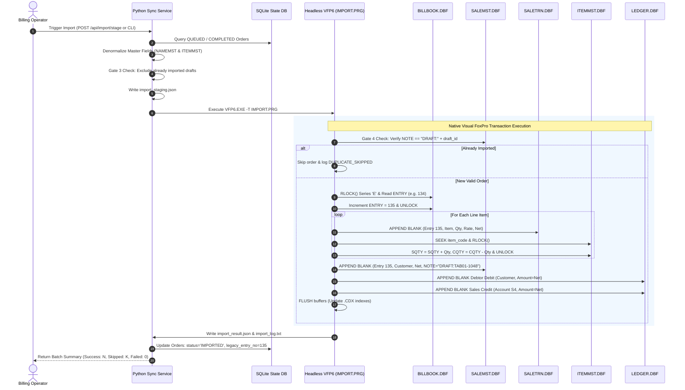

# FoxPro Native Import Workflow, Duplicate Protection & Test Plan (Phase 3B)
**System:** RAM FATAKA CENTER Billing System (FAVWIN / Visual FoxPro 6.0)  
**Database Directory:** `legacy-software-extracted/FAVWIN/D2627/`  
**Execution Runtime:** Headless Visual FoxPro 6.0 (`VFP6.EXE -T -C"CONFIG.FPW" IMPORT.PRG`)  
**Document Status:** Implementation Specification & Verification Protocol

---

## 1. End-to-End Import Architecture & Workflow

The import workflow transitions orders captured on Android tablets into fully posted, indexed, and balanced invoices in the legacy Visual FoxPro database without direct DBF binary writing.



---

## 2. Step-by-Step Database Mutation Specification

Every imported invoice strictly executes five coordinated operations inside `IMPORT.PRG`:

### Step 2.1: Atomic Invoice Number Reservation (`BILLBOOK.DBF`)
1. In `BILLBOOK.DBF`, seek the record where `CODE = "E "`.
2. Execute `RLOCK()` with a retry loop (10 attempts, 0.2s backoff).
3. Extract `lnEntry = BILLBOOK.ENTRY + 1`.
4. Update `REPLACE BILLBOOK.ENTRY WITH lnEntry`.
5. Release lock with `UNLOCK`.
6. This guarantees that concurrent billing clerks in `FAVWIN.EXE` never receive a duplicate invoice number.

### Step 2.2: Line Item Insertion (`SALETRN.DBF`)
For each item in the staging order:
1. Append blank record to `SALETRN.DBF`.
2. Populate all 18 active transaction fields:
   - `ENTRY`: `lnEntry`
   - `COME`: `"E "`
   - `CD`: `"D"`
   - `DATE`: `tdDate` (from order date)
   - `PCODE`: Customer code (e.g. `"01149"`)
   - `ACODE`: Customer geographic area code (e.g. `"44   "`)
   - `SCODE`: Salesman code (`"SELF "`)
   - `ICODE`: 5-character item code from `ITEMMST.CODE`
   - `GCODE`: Item group code (e.g. `"MIX  "`)
   - `CCODE`: Brand code (e.g. `"50   "`)
   - `QTY`: Sold quantity
   - `RATE`: Unit rate
   - `RTTP`: Rate type (`"P"`)
   - `GAMT`: Gross amount (`QTY * RATE`)
   - `TCODE`: Tax classification code (`"CST  "`)
   - `TAXP`: `0.00`
   - `TAMT`: Taxable amount
   - `NAMT`: Line net amount
   - `USER`: Operator username (`"RAM       "`)
   - `UNIT`: Unit of measurement (`"BOX  "`, `"PKT  "`, `"PCS  "`)

### Step 2.3: Quantitative Stock Deduction (`ITEMMST.DBF`)
For each line item:
1. Seek `ITEMMST` on `TAG code` using `ICODE`.
2. If found, acquire `RLOCK()`.
3. Update stock counters:
   $$\text{SQTY} = \text{SQTY} + \text{quantity}$$
   $$\text{CQTY} = \text{CQTY} - \text{quantity}$$
4. Release record lock.

### Step 2.4: Invoice Header Insertion (`SALEMST.DBF`)
1. Append blank record to `SALEMST.DBF`.
2. Populate header fields:
   - `ENTRY`: `lnEntry`
   - `COME`: `"E "`
   - `DATE`: `tdDate`
   - `PCODE`: Customer code
   - `SCODE`: `"SELF "`
   - `CD`: `"D"`
   - `T4A`: Gross taxable sum of all lines
   - `ADD`: `0.00`
   - `LESS`: `0.00`
   - `ROFF`: Computed round-off adjustment
   - `NAMT`: Net grand total
   - `USER`: `"RAM       "`
   - `PNAME`: Full customer trade name
   - `NOTE`: `"DRAFT:" + ALLTRIM(draft_id)` (Padded to 40 characters)
   - `REMA`: Order customer remarks

### Step 2.5: Double-Entry Financial Journal Generation (`LEDGER.DBF`)
Post two balanced records:
1. **Debtor Account Debit:**
   - `ENTRY = lnEntry`, `COME = "E "`, `DATE = tdDate`
   - `DCODE = customer_code`, `CCODE = "     "`, `NHEAD = "S0   "`
   - `AMOUNT = NAMT`, `IND = "SL"`, `USER = "RAM       "`
   - `NARA1 = "INV.NO.E / " + STR(lnEntry, 5)`
2. **Sales Revenue Credit:**
   - `ENTRY = lnEntry`, `COME = "E "`, `DATE = tdDate`
   - `DCODE = "     "`, `CCODE = "S4   "`, `NHEAD = customer_code`
   - `AMOUNT = NAMT`, `IND = "SL"`, `USER = "RAM       "`
   - `NARA1 = "INV.NO.E / " + STR(lnEntry, 5)`

---

## 3. Four-Tier Duplicate Prevention Architecture

To make double-billing impossible across network retries, tablet re-syncs, and repeated operator imports, the system enforces a strict 4-tier deduplication pipeline:

```
[Tablet POS]  ──> Gate 1: Client UUID & Local Outbox De-dup
                      │
[Sync Service]──> Gate 2: SQLite UNIQUE (draft_id) & Idempotency Key
                      │
[Order Exporter]─> Gate 3: Exclude if legacy_entry_no IS NOT NULL or in SALEMST
                      │
[FoxPro IMPORT]─> Gate 4: Runtime LOCATE FOR NOTE == "DRAFT:" + draft_id
```

| Tier | Enforcement Point | Mechanism | Action on Collision |
|---|---|---|---|
| **Gate 1** | Tablet Client | Local outbox flags orders as `SYNCED` upon 200/201 response. Re-sync sends identical `draft_id`. | Tablet does not resubmit completed orders. |
| **Gate 2** | Sync Service API | SQLite column `orders.draft_id` has a `UNIQUE` constraint. `idempotency_key` table caches previous API responses. | Returns HTTP 200 with original `order_id` without creating a duplicate row. |
| **Gate 3** | Python Exporter | Query selects only orders where `legacy_entry_no IS NULL` and cross-references `SALEMST.NOTE`. | Skips already-invoiced drafts; marks status as `IMPORTED`. |
| **Gate 4** | FoxPro `IMPORT.PRG` | Before reserving `BILLBOOK.ENTRY`, executes: `SELECT SALEMST; LOCATE FOR ALLTRIM(NOTE) == "DRAFT:" + draft_id`. | If found, skips order, writes `"status": "SKIPPED"` to `import_result.json`, and increments `skipped_count`. |

---

## 4. Rollback and Disaster Recovery Strategy

Visual FoxPro free tables do not provide transactional ACID rollback if an error occurs midway through writing lines. `IMPORT.PRG` implements comprehensive programmatic rollback:

### 4.1 In-Flight Failure Rollback Algorithm
If an unhandled error occurs during the insertion of line items or header:
1. **Track Inserted Items:** `IMPORT.PRG` tracks every inserted item in an in-memory array: `laInsertedItems[lnCount, (item_code, qty)]`.
2. **Revert Inventory:** For each recorded item, it seeks `ITEMMST` and restores the original counters:
   $$\text{SQTY} = \text{SQTY} - \text{quantity}$$
   $$\text{CQTY} = \text{CQTY} + \text{quantity}$$
3. **Delete Orphan Line Items:**
   ```foxpro
   SELECT SALETRN
   DELETE FOR ENTRY = lnEntry AND ALLTRIM(COME) == "E"
   ```
4. **Delete Orphan Header:**
   ```foxpro
   SELECT SALEMST
   DELETE FOR ENTRY = lnEntry AND ALLTRIM(COME) == "E"
   ```
5. **Delete Orphan Ledger Records:**
   ```foxpro
   SELECT LEDGER
   DELETE FOR ENTRY = lnEntry AND ALLTRIM(COME) == "E"
   ```
6. **Revert Sequence Counter:** If `BILLBOOK.ENTRY == lnEntry`, it reverts the counter back by 1:
   ```foxpro
   REPLACE BILLBOOK.ENTRY WITH lnEntry - 1
   ```
7. **Write Failure Audit:** Writes error reason to `import_log.txt` and records `"FAILED"` status in `import_result.json`.

### 4.2 Power Loss / Hard Crash Recovery Procedure
In the event of an operating system crash or power outage while `IMPORT.PRG` is executing:
1. **Automated Recovery Check:** On next startup, the Windows Sync Service reads `import_result.json` and compares `orders.legacy_entry_no` against `SALEMST.DBF`.
2. **Re-Indexing Safeguard:** Because all operations occur under shared locks, if FoxPro reports an index mismatch, executing `REINDEX` inside FoxPro restores all `.CDX` trees cleanly.
3. **Safe Re-run:** Re-running the exporter and `IMPORT.PRG` is safe because Gate 4 prevents any previously committed drafts from being re-inserted.

---

## 5. Comprehensive Test Plan

### Test Environment Prerequisites
* Test data directory with copies of `BILLBOOK.DBF/CDX`, `SALEMST.DBF/CDX`, `SALETRN.DBF/CDX`, `ITEMMST.DBF/CDX`, `LEDGER.DBF/CDX`.
* Python Sync Service running on virtual environment `.venv`.
* Valid test customer: Code `'01149'` (`NEW SHIVA BALAJI DASARWAR`).
* Valid test products: Code `'06122'` (10cm Sparklers), `'02152'` (Ring Caps).

---

### Test Cases Matrix

| Test ID | Test Scenario | Input Data | Expected Result | Pass Criteria |
|:---:|---|---|---|---|
| **TC-01** | **Normal Single Order Export & Staging** | 1 order with 2 items in SQLite (`status='QUEUED'`) | `OrderExporter.export_queued_orders()` emits `import_staging.json` matching `staging_schema.json`. | JSON file created; gross, net, roundoff, customer code, and note match order. |
| **TC-02** | **Full Denormalization of Line Items** | Item `'06122'`, Customer `'01149'` | Line item in staging contains `group_code="MIX  "`, `company_code="50   "`, `unit="BOX  "`, `area_code="44   "`. | Redundant master attributes correctly populated from DBFs. |
| **TC-03** | **Gate 2: SQLite Draft Deduplication** | Duplicate `POST /api/orders` with same `draft_id="TAB01-1048"` | HTTP 200 returned with existing `order_id`; no duplicate row in SQLite. | `SELECT COUNT(*) FROM orders WHERE draft_id='TAB01-1048'` equals 1. |
| **TC-04** | **Gate 3: Exporter Skips Invoiced Orders** | Order with `legacy_entry_no=135` | Exporter ignores order during batch extraction. | `exported_count == 0` in staging payload. |
| **TC-05** | **Gate 4: Runtime FoxPro Deduplication** | `import_staging.json` containing draft ID already present in `SALEMST.NOTE` | `IMPORT.PRG` detects existing note, logs `"GATE 4 SKIPPED"`, does not increment `BILLBOOK.ENTRY`. | `import_result.json` contains `"status": "SKIPPED"`, `skipped_count = 1`. |
| **TC-06** | **Sequence Counter Reservation** | `BILLBOOK.ENTRY` currently at `134` | `IMPORT.PRG` locks `BILLBOOK`, assigns entry `135`, increments `ENTRY` to `135`. | `SALEMST.ENTRY == 135` and `BILLBOOK.ENTRY == 135`. |
| **TC-07** | **Inventory Quantitative Balance Update** | Item `'06122'` with initial `SQTY=100`, `CQTY=500`. Sold `QTY=15`. | `ITEMMST.SQTY` becomes `115`, `ITEMMST.CQTY` becomes `485`. | Stock equation $\text{CQTY} = \text{OQTY} + \text{PQTY} - \text{SQTY}$ remains exact. |
| **TC-08** | **Financial Double-Entry Ledger Verification** | Invoice #135 with `NAMT=2600.00` | Two records in `LEDGER.DBF`: 1) Debtor Debit (`DCODE="01149"`, `AMOUNT=2600.00`), 2) Sales Credit (`CCODE="S4   "`, `AMOUNT=2600.00`). | Both ledger records share `ENTRY=135`, `NARA1="INV.NO.E /  135"`, `IND="SL"`. |
| **TC-09** | **In-Flight Rollback on Missing Product** | Staging payload with invalid item code `'99998'` | `IMPORT.PRG` aborts item processing, executes `RollbackInvoice()`, deletes orphan lines, restores stock for prior lines, reverts `BILLBOOK.ENTRY`. | No orphan header or lines left in DBFs; `BILLBOOK.ENTRY` unchanged. |
| **TC-10** | **Concurrency Protection Under Load** | Run import script while operator opens FAVWIN invoice screen | `RLOCK()` acquires shared lock without collision; both operations complete without file lock error. | Zero `"Record in use by another user"` crashes. |

---

## 6. Execution Command Quick-Reference

### Step 1: Export Pending Orders to Staging Payload (Python)
```bash
# Using CLI tool
python sync-service/export_orders.py --output import_staging.json --user RAM --salesman SELF

# Or via REST API
curl -X POST http://localhost:8080/api/import/stage \
     -H "Content-Type: application/json" \
     -d '{"user": "RAM", "salesman": "SELF", "output_file": "import_staging.json"}'
```

### Step 2: Execute Headless Native FoxPro Ingestion (Windows)
```cmd
cd \FAVWIN\D2627
VFP6.EXE -T -C"CONFIG.FPW" IMPORT.PRG
```

### Step 3: Inspect Execution Results
```bash
# Check JSON results
cat import_result.json

# Check human-readable audit log
cat import_log.txt
```
