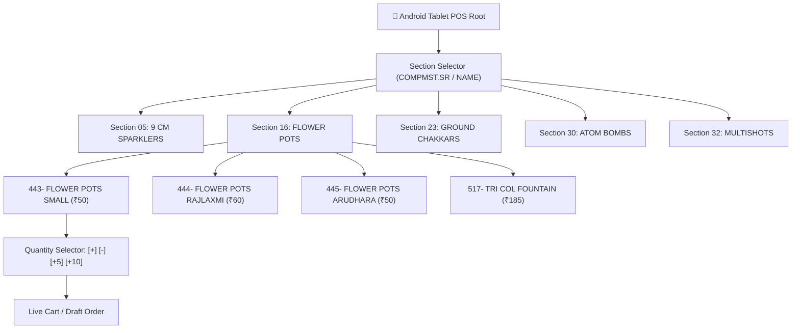

# Legacy FoxPro Catalog Strategy & Data Pipeline (Phase 2.6)
**System:** RAM FATAKA CENTER Billing & POS Integration  
**Data Sources:** `COMPMST.DBF`, `ITEMMST.DBF`, `TYPES.DBF`  
**Core Constraint:** 100% Native FoxPro Data — No External Excel Dependencies  
**Document Status:** Technical Architecture & Strategy Guide

---

## 1. Empirical Analysis of Legacy Catalog Groupings

To replicate showroom selling without external files, we examined all grouping mechanisms present across the legacy FoxPro database files in `D2627`:

### 1.1 The Role of `GROUPMST.DBF` & `GROUPSUB.DBF`
- **Schema:** `GROUPMST` contains `CODE C(5)`, `NAME C(20)`. `GROUPSUB` contains `CODE C(5)`, `UCODE C(5)`, `FACT N(5)`, `NAME C(20)`.
- **Actual Data:**
  - `GROUPMST.DBF` contains exactly **one record**: `CODE = 'MIX'`, `NAME = 'MIX'`.
  - `GROUPSUB.DBF` contains exactly **one record**: `CODE = 'PKT'`, `FACT = 1`.
  - `ITEMMST.GCODE` contains `'MIX'` for **100% of all 3,019 products**.
- **Conclusion:**
  `GROUPMST` and `GROUPSUB` were never maintained as functional category hierarchies; they act purely as static database defaults. They cannot be used for tablet navigation.

---

### 1.2 The True Catalog Backbone: `COMPMST.DBF` (Company Master)
- **Schema:** `CODE C(5)`, `NAME C(40)`, `SR N(3,0)`.
- **Actual Data:**
  - Contains **53 records** with sequential serial numbers (`SR = 1 to 53`).
  - **42 of these 53 records** actively link to products in `ITEMMST.DBF` via `ITEMMST.CCODE == COMPMST.CODE`.
- **Key Realization:**
  Although labeled "Company Master", the legacy billing operator repurposed this table as **Showroom Product Sections**:
  - `SR = 1`: `ROLL AND DOT CAPS`
  - `SR = 5`: `9 CM SPARKLERS`
  - `SR = 11`: `RED, STRIPPED, GOLD BIJALI & BASKET BOMB`
  - `SR = 15`: `ONE SOUND DHAMAKA`
  - `SR = 18`: `FLOWER POTS COL KOTI, MEGA DLX, SUP DLX`
  - `SR = 25`: `GROUND CHAKKAR BIG, ASHOKA, SPL, DLX`
  - `SR = 27`: `ROCKETS BOMB, LUNIK ROCKETS, 2 & 3 SOUND`
  - `SR = 32`: `ATOM BOMB`
  - `SR = 33`: `GARLAND & LAR`
  - `SR = 34`: `SHOTS & MULTISHOTS`
  - `SR = 39`: `GUNS & PISTOLS`

---

### 1.3 The Item-Level Ordering Code: Prefixes in `ITEMMST.NAME`
In fireworks wholesale operations, paper order forms list items with printed serial numbers. The legacy operator systematically embedded these numbers at the beginning of each `ITEMMST.NAME`:
- `111- ROLL CAPS AGNI`
- `178- 9 CM PLAIN INDRA (10 DABBI=1BOX)`
- `443- FLOWER POTS SMALL (10 P)`
- `588- G C BIG T/MEENA (10 P)`
- `735- BULLET BOMB MINI SRI ATHISAYA (10 P)`
- `840- 6 SHOTS BIG ROYAL-SALUTE AYYAN`

Because these numbers increase monotonically across `COMPMST.SR` sections, **sorting items by their numeric prefix perfectly reconstructs the physical flow of the showroom**.

---

## 2. Recommended Navigation Hierarchy

Using only existing DBF fields, the optimal tablet navigation hierarchy is:



### Hierarchy Definition:
1. **Top Level: Showroom Section**
   - Source: `COMPMST.DBF` where `CODE IN (SELECT DISTINCT CCODE FROM ITEMMST)`
   - Sequence: Ascending order of `COMPMST.SR` (1, 2, 3... 43).
   - Display Label: `COMPMST.NAME` (e.g. `FLOWER POTS COL KOTI`).
2. **Second Level: Product Card List**
   - Source: `ITEMMST.DBF` where `CCODE == COMPMST.CODE`.
   - Sequence: Natural numerical sort on prefix parsed from `ITEMMST.NAME` (e.g. `443`, `444`, `445`).
   - Card Display:
     - Header: Cleaned Item Name (from `ITEMMST.NAME`).
     - Sub-label: FoxPro Code (`ITEMMST.CODE`) & Pack Unit (`ITEMMST.PACK`).
     - Price: Wholesale selling rate (`ITEMMST.SRATE`).
     - Stock Status: Available balance (`ITEMMST.CQTY`).
3. **Third Level: Direct Quantity Modification**
   - Quick increment/decrement buttons (`+1`, `+5`, `+10`) for rapid entry.

---

## 3. Data Sanitization & Filtering Rules

Out of 3,019 physical records in `ITEMMST.DBF`, only **1,091 are valid sellable active items**. The Sync Service must enforce three deterministic filters:

### 3.1 Rule 1: Eliminate Empty and Dummy Placeholder Records
- **Observation:** There are 1,705 records with completely blank names or dummy stub entries like `'292-'`, `'335-'`, `'447-'`.
- **Filter Rule:**
  ```python
  def is_valid_named_product(name: str) -> bool:
      if not name or len(name.strip()) < 5:
          return False
      # Must contain alphabetic characters (eliminates "447-", "123-")
      return any(c.isalpha() for c in name)
  ```

### 3.2 Rule 2: Eliminate Inactive / Zero-Priced Items
- **Observation:** 223 items have a selling price of `0.00` (historical discontinued items).
- **Filter Rule:**
  ```python
  def is_sellable_product(item: dict) -> bool:
      srate = float(item.get("SRATE", 0.0) or 0.0)
      return srate > 0.0
  ```

### 3.3 Rule 3: Natural Numeric Sorting on Name Prefix
- **Problem:** Standard alphabetical sorting causes `'1117- RING CAPS'` to appear *before* `'120- BEN TEN'`, breaking catalog flow.
- **Filter Rule:**
  Extract leading digits with regular expression `^(\d+)` and sort numerically:
  ```python
  import re
  def get_item_sort_key(item: dict) -> int:
      name = item.get("NAME", "").strip()
      match = re.match(r"^(\d+)", name)
      return int(match.group(1)) if match else 99999
  ```

### 3.4 Rule 4: Out-of-Stock Handling (`CQTY <= 0`)
- **Policy:** **Do NOT hide out-of-stock items.**
- **Reason:** In wholesale fireworks showrooms, customers often ask for items out of stock on the shelf, which staff can retrieve from the central godown.
- **Display:** Show card with a distinct **Amber / Red "Out of Stock" (CQTY: 0)** badge, but allow adding to cart if the salesman confirms godown availability.

---

## 4. Technical Integration in Windows Sync Service

To deliver this experience to Android tablets without modifying FoxPro DBFs, the Python Sync Service exposes two specialized endpoints:

### 4.1 `GET /api/sync/sections`
Returns the 42 active showroom sections in sequence of `COMPMST.SR`:
```json
{
  "total_sections": 42,
  "sections": [
    {
      "sr": 1,
      "code": "1",
      "name": "ROLL AND DOT CAPS",
      "active_items_count": 3
    },
    {
      "sr": 5,
      "code": "5",
      "name": "9 CM SPARKLERS",
      "active_items_count": 14
    },
    {
      "sr": 16,
      "code": "18",
      "name": "FLOWER POTS COL KOTI, MEGA DLX, SUP DLX",
      "active_items_count": 74
    }
  ]
}
```

### 4.2 `GET /api/sync/products` (Enriched with Section Metadata)
Each product includes its `section_sr`, `section_name`, `catalog_no`, and `is_in_stock`:
```json
{
  "code": "00443",
  "name": "443- FLOWER POTS SMALL (10 P)",
  "catalog_no": 443,
  "section_code": "18",
  "section_sr": 16,
  "section_name": "FLOWER POTS COL KOTI, MEGA DLX, SUP DLX",
  "pack": "PKT",
  "selling_rate": 50.0,
  "stock_on_hand": 450.0,
  "is_in_stock": true
}
```

---

## 5. Summary: Why This Strategy Succeeds

1. **Zero External Data Maintenance:** The shop owner never needs to maintain an Excel spreadsheet. Adding or updating a price in FoxPro instantly updates all tablets.
2. **Intuitive for Existing Staff:** Salesmen who have worked at RAM FATAKA CENTER for years already know the catalog numbers (`"178 is plain sparkler"`, `"443 is small anar"`, `"735 is bullet bomb"`). The tablet reinforces their existing mental model.
3. **Rapid Showroom Traversal:** The left section sidebar functions like turning pages on a clipboard, enabling a 60-second ordering flow for a 15-item festival order.
