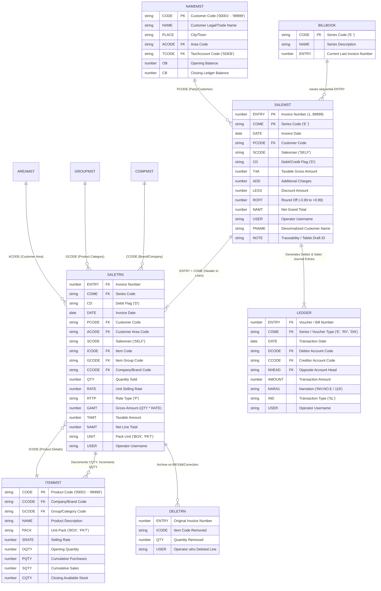

# FoxPro Billing Table Relationships & Data Propagation (Phase 3A)
**System:** RAM FATAKA CENTER Billing System (FAVWIN / Visual FoxPro 6.0)  
**Database Directory:** `legacy-software-extracted/FAVWIN/D2627/`  
**Document Status:** Schema & Relationship Analysis (Read-Only)

---

## 1. Entity-Relationship Diagram (ERD)

The diagram below illustrates the relational model of FAVWIN's billing subsystem, including master catalogs, transaction stores, stock tracking, and the financial accounting ledger.



---

## 2. Table Primary and Foreign Keys

| Table Name | Primary Key | Foreign Keys & Linkages | Description |
|---|---|---|---|
| **`BILLBOOK.DBF`** | `CODE` | *None* | Contains bill series definitions (e.g. `'E'`) and atomic sequence counter `ENTRY`. |
| **`NAMEMST.DBF`** | `CODE` | `ACODE` $\to$ `AREAMST.CODE`<br>`TCODE` $\to$ `TAXMST.CODE` | Customer master table containing contact, area, and balance info. |
| **`ITEMMST.DBF`** | `CODE` | `CCODE` $\to$ `COMPMST.CODE`<br>`GCODE` $\to$ `GROUPMST.CODE`<br>`TCODE` $\to$ `TAXMST.CODE` | Product master catalog containing rates, packaging, and stock levels. |
| **`SALEMST.DBF`** | `(ENTRY, COME)` | `PCODE` $\to$ `NAMEMST.CODE`<br>`SCODE` $\to$ `SALESMAN.CODE` | Invoice header. Compound key `(ENTRY, COME)` identifies each bill uniquely. |
| **`SALETRN.DBF`** | *Composite / Surrogate* | `(ENTRY, COME)` $\to$ `SALEMST`<br>`PCODE` $\to$ `NAMEMST.CODE`<br>`ICODE` $\to$ `ITEMMST.CODE`<br>`ACODE` $\to$ `AREAMST.CODE`<br>`CCODE` $\to$ `COMPMST.CODE`<br>`GCODE` $\to$ `GROUPMST.CODE` | Invoice line items. Highly denormalized; carries copies of party and product attributes. |
| **`LEDGER.DBF`** | *Surrogate* | `(ENTRY, COME)` $\to$ `SALEMST`<br>`DCODE` $\to$ `NAMEMST.CODE`<br>`CCODE` $\to$ `SALEMST` or Sales Heads (`'S4'`) | Double-entry journal vouchers tracking customer balances and sales turnover. |
| **`DELETRN.DBF`** | *Surrogate* | `(ENTRY, COME)` $\to$ `SALEMST`<br>`ICODE` $\to$ `ITEMMST.CODE` | Audit archive of line items deleted or replaced during bill editing. |

---

## 3. Data Propagation Paths During Invoice Creation

When an order is converted into a legacy FoxPro invoice, data propagates through four distinct subsystems:

```
                      [TABLET ORDER INPUT]
                               │
            ┌──────────────────┴──────────────────┐
            ▼                                     ▼
   [Customer Lookup]                      [Product Items Loop]
     (NAMEMST.DBF)                          (ITEMMST.DBF)
            │                                     │
            │ PCODE, PNAME, ACODE                 │ ICODE, GCODE, CCODE, PACK, RATE
            │                                     │
            ▼                                     ▼
   ┌─────────────────┐                   ┌─────────────────┐
   │   SALEMST.DBF   │                   │   SALETRN.DBF   │
   │ (Header Record) │                   │  (Line Items)   │
   │                 │<──────────────────│                 │
   │  Total: NAMT    │   Sum of GAMT     │  Qty & Amounts  │
   └────────┬────────┘                   └────────┬────────┘
            │                                     │
            │                                     ▼
            │                            ┌─────────────────┐
            │                            │   ITEMMST.DBF   │
            │                            │ (Stock Update)  │
            │                            │                 │
            │                            │ SQTY = SQTY + Q │
            │                            │ CQTY = CQTY - Q │
            │                            └─────────────────┘
            │
            ▼
   ┌─────────────────┐
   │   LEDGER.DBF    │
   │ (Double Entry)  │
   │                 │
   │ 1. Debit Party  │
   │ 2. Credit Sale  │
   └─────────────────┘
```

### 3.1 Step 1: Sequence Counter Reservation (`BILLBOOK.DBF`)
1. Lock `BILLBOOK.DBF` record where `CODE = 'E'`.
2. Extract current `ENTRY` (e.g. `134`).
3. Compute `new_entry = 135`.
4. Update `BILLBOOK.ENTRY = 135`.
5. Release record lock.

### 3.2 Step 2: Line Items Propagation (`SALETRN.DBF`)
For each item in the order:
1. Locate `ITEMMST` by `ICODE`:
   - Verify `NAME`, `PACK` (`UNIT`), `CCODE`, `GCODE`, `TCODE`.
2. Append record to `SALETRN.DBF`:
   - `ENTRY = 135`
   - `COME = 'E'`
   - `CD = 'D'`
   - `DATE = order_date`
   - `PCODE = order.customer_code`
   - `ACODE = customer.ACODE`
   - `SCODE = 'SELF'`
   - `ICODE = item.product_code`
   - `GCODE = item.GCODE`
   - `CCODE = item.CCODE`
   - `QTY = item.quantity`
   - `RATE = item.unit_price`
   - `RTTP = 'P'`
   - `GAMT = item.quantity * item.unit_price`
   - `TCODE = item.TCODE`
   - `TAMT = GAMT`
   - `NAMT = GAMT`
   - `UNIT = item.PACK`
   - `USER = 'RAM'`

### 3.3 Step 3: Stock Balance Deduction (`ITEMMST.DBF`)
For each item in the order:
1. Seek `ITEMMST` on `TAG code` with `ICODE`.
2. Update:
   - `SQTY = SQTY + item.quantity` (Increments cumulative sales).
   - `CQTY = CQTY - item.quantity` (Decrements available closing stock).

### 3.4 Step 4: Invoice Header Propagation (`SALEMST.DBF`)
1. Compute aggregated figures:
   - `T4A = SUM(SALETRN.GAMT)`
   - `LESS = order.discount`
   - `ADD = order.additional_charges`
   - `ROFF = round_off(T4A + ADD - LESS) - (T4A + ADD - LESS)`
   - `NAMT = T4A + ADD - LESS + ROFF`
2. Append record to `SALEMST.DBF`:
   - `ENTRY = 135`
   - `COME = 'E'`
   - `DATE = order_date`
   - `PCODE = order.customer_code`
   - `SCODE = 'SELF'`
   - `CD = 'D'`
   - `T4A = calculated_gross`
   - `LESS = calculated_less`
   - `ROFF = calculated_roundoff`
   - `NAMT = calculated_net`
   - `USER = 'RAM'`
   - `PNAME = customer.NAME`
   - `NOTE = 'DRAFT:' + order.draft_id` (Ensures 100% tablet traceability)

### 3.5 Step 5: Double-Entry Financial Journal Posting (`LEDGER.DBF`)
1. **Debtor Debit Entry:**
   - `ENTRY = 135`
   - `COME = 'E'`
   - `DATE = order_date`
   - `DCODE = customer.CODE`
   - `CCODE = ''`
   - `NHEAD = 'S0'` (Debtors control account)
   - `AMOUNT = NAMT`
   - `NARA1 = 'INV.NO.E /  135'`
   - `IND = 'SL'`
   - `USER = 'RAM'`
2. **Sales Account Credit Entry:**
   - `ENTRY = 135`
   - `COME = 'E'`
   - `DATE = order_date`
   - `DCODE = ''`
   - `CCODE = 'S4'` (Sales income account)
   - `NHEAD = customer.CODE`
   - `AMOUNT = NAMT`
   - `NARA1 = 'INV.NO.E /  135'`
   - `IND = 'SL'`
   - `USER = 'RAM'`

---

## 4. Compound Binary Index (`.CDX`) Dependency Map

Every database table in FAVWIN has an associated Compound Index file (`.CDX`). FoxPro maintains these indexes automatically as balanced B-Trees. Modifying a `.DBF` without simultaneously updating these trees breaks lookups and generates fatal runtime exceptions.

| Table Name | Associated Index File | Active Index Tags | Key Expression in FoxPro | Business Purpose |
|---|---|---|---|---|
| **`BILLBOOK.DBF`** | `BILLBOOK.CDX` | `CODE`<br>`NAME` | `code`<br>`name` | Quick seek for billing series (`'E'`). |
| **`NAMEMST.DBF`** | `NAMEMST.CDX` | `CODE`<br>`NAME`<br>`ACODE`<br>`TCODE` | `code`<br>`name`<br>`acode`<br>`tcode` | Customer selection popup, alphabetic search, and area grouping. |
| **`ITEMMST.DBF`** | `ITEMMST.CDX` | `CODE`<br>`NAME`<br>`CCODE`<br>`GCODE`<br>`PACK` | `code`<br>`name`<br>`ccode`<br>`gcode`<br>`pack` | Real-time product search in billing grid and stock valuation reports. |
| **`SALEMST.DBF`** | `SALEMST.CDX` | `ENTRY`<br>`DATE`<br>`PCODE` | `str(entry,5)`<br>`dtos(date)`<br>`pcode` | Bill modification retrieval (`<CORRECT>`), daily register, customer ledger. |
| **`SALETRN.DBF`** | `SALETRN.CDX` | `ENTRY`<br>`DATE`<br>`PCODE`<br>`ICODE` | `str(entry,5)`<br>`dtos(date)`<br>`pcode`<br>`icode` | Line items retrieval for invoice reprint, product sales history, customer sales summary. |
| **`LEDGER.DBF`** | `LEDGER.CDX` | `ENTRY`<br>`DATE`<br>`DCODE`<br>`CCODE` | `str(entry,5)`<br>`dtos(date)`<br>`dcode`<br>`ccode` | Customer ledger statements, balance calculations, trial balance, and journal register. |

---

## 5. Architectural Implications for Order Import

1. **Denormalization Must Be Replicated:**
   Because `SALETRN.DBF` duplicates `PCODE`, `ACODE`, `GCODE`, `CCODE`, and `UNIT`, the import program cannot merely insert line item IDs and quantities; it must pull these parent attributes during the import pass.
2. **Double-Entry Cannot Be Bypassed:**
   Writing only to `SALEMST` and `SALETRN` creates "ghost invoices" that appear on bill printouts but are invisible to customer balance reports and cash-flow registers.
3. **FoxPro Engine Execution is Mandatory:**
   Because 6 separate `.CDX` index tags are involved across 4 tables for every single invoice, executing via the native Visual FoxPro engine (`IMPORT.PRG`) is the only method that guarantees complete B-Tree consistency.
